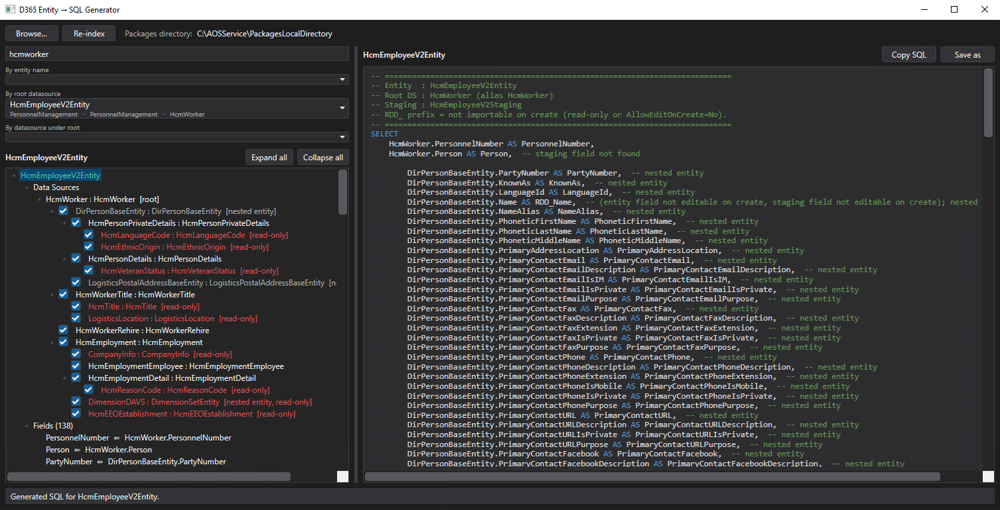
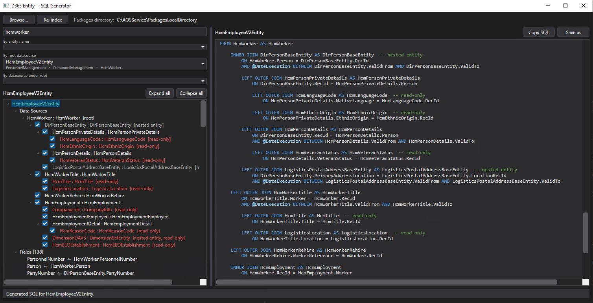

# D365 Entity → SQL Generator

A Windows desktop tool (WPF, .NET 8) that reads **Dynamics 365 Finance & Operations** data-entity metadata directly from a local `PackagesLocalDirectory` and generates a ready-to-adapt **T-SQL `SELECT`** that mirrors the entity: the datasource joins, the field-to-column mapping (`Source.Field AS EntityField`), company (`DataAreaId`) filtering, date-effectivity, and per-field import/edit annotations.

It was built to speed up **data migrations into D365** — instead of opening an entity in Visual Studio and hand-writing the joins and field mappings for every entity you need to stage and import, you pick the entity and get the scaffold instantly, then repoint the `FROM` tables to your source/staging database.

> Migration context: the generated table names are the AOT/D365 names (which for an AX2012 source are mostly identical). You do the final edits to point them at your actual source tables, or extend the tool with source-profile mappings later.

---

## Demo




## Features

- **Metadata-driven.** Parses `AxDataEntityView` and `AxTable` XML from `PackagesLocalDirectory` — no running AOS, database, or Visual Studio required.
- **Search** by entity name, root datasource table, or any datasource table (three dropdowns).
- **VS-style entity tree** showing the datasource hierarchy and the fields.
- **Generated `SELECT`** with:
  - Datasource **aliases = entity datasource names** (so multiple datasources over the same table stay distinct).
  - **Joins** resolved from the entity query — explicit field pairs, named table relations, and `RelatedTableRole` matches; `JoinMode` mapped to `INNER` / `LEFT OUTER JOIN`.
  - **`DataAreaId`** woven into joins and the root `WHERE` for company-specific tables (`SaveDataPerCompany`), skipped for global tables.
  - **Datasource ranges** (e.g. `EmploymentType = 'Employee'`) added to the relevant `ON` / `WHERE`.
  - **Date-effectivity**: `ApplyDateFilter` datasources get `@DateExecution BETWEEN ValidFrom AND ValidTo`.
  - **Fields grouped by datasource**, in tree order, indented by depth, entity field order preserved, blank line between groups.
  - **Computed / view-method fields** flagged and pushed to the end (`NULL AS …`).
- **Import annotations.** Fields not importable on create are prefixed **`RDD_`** with a parenthetical reason. A field is flagged when `AllowEditOnCreate = No` in **any** of three places — entity field, staging table field, target (backing) table field — or when its datasource / the entity is read-only.
- **Tree signalling.** Red nodes for read-only entities, read-only datasources, and entities not enabled for data management (no staging table).
- **Toggle datasources** on/off with checkboxes: a disabled datasource (and its children) is dimmed in the tree and dropped from the generated SQL, which regenerates instantly.
- **SQL pane** with syntax highlighting, **Ctrl+F** find (with match count and highlight), **Copy** and **Save as** (`.sql`, defaulting to the entity name).
- **Dark theme.**

---

## Requirements

- Windows
- [.NET 8 SDK](https://dotnet.microsoft.com/download) (or the .NET 8 Desktop Runtime to run a published build)
- A local D365 F&O `PackagesLocalDirectory` (typically on a developer VM, e.g. `C:\AOSService\PackagesLocalDirectory` or `K:\AosService\PackagesLocalDirectory`)

## Build & run

```bash
dotnet build
dotnet run --project D365EntitySqlGenerator
```

Or produce a self-contained/framework-dependent build:

```bash
dotnet publish -c Release
```

## Usage

1. Click **Browse…** and select your `PackagesLocalDirectory`. The path is remembered per machine; on a new box you select it again.
2. The tool scans the folder and builds a datasource search index in the background (cached, so subsequent launches are instant).
3. Type in the search box; pick an entity from one of the three dropdowns (by entity name / root datasource / datasource under root).
4. Read the tree on the left and the generated SQL on the right. Untick datasources you don't want. **Copy** or **Save as** the script.

The generated SQL uses two parameters your ETL is expected to supply:

- `@DataAreaId` — the company to migrate.
- `@DateExecution` — the as-of date for date-effective datasources (typically `GETUTCDATE()`).

## How joins are resolved

For each embedded datasource the tool determines the `ON` conditions by, in order:

1. an explicit `Field` / `RelatedField` pair on the entity relation;
2. a table relation whose **name** matches the `JoinRelationName` (on the child or parent table);
3. a table relation whose **`RelatedTableRole`** matches;
4. as a fallback, the single relation between the two datasource tables — emitted with a `-- note: … (verify)` because it is a best guess;
5. otherwise a `-- TODO` marker so you can complete it by hand.

**Nested entities** (a datasource whose table is itself another entity) are kept opaque: they are emitted with their own name and fields and a `-- nested entity` comment, on the assumption that you stage those entities beforehand.

## Where settings live

- `%AppData%\D365EntitySqlGenerator\settings.json` — the remembered `PackagesLocalDirectory`.
- `%AppData%\D365EntitySqlGenerator\index-cache.json` — the cached datasource search index (keyed to the packages path; use **Re-index** to rebuild it).

## Project layout

```
D365EntitySqlGenerator/
├─ Models/       metadata POCOs (entity, datasource tree, table, fields, relations)
├─ Services/     parsers (entity, table), metadata index, relation & editability resolvers, SQL generator
├─ ViewModels/   MVVM (main view model, tree nodes)
├─ Views/        MainWindow, SQL highlighter
└─ Themes/       dark theme resource dictionary
```

## Limitations / notes

- Generated table names are AOT names; repoint the `FROM` side to your source for anything that differs.
- Enum range values are emitted as string literals (e.g. `'Employee'`); map them to the stored integer for your source database.
- Named relations resolved by the table-pair fallback are marked `(verify)`; a small tail of table-inheritance joins are left as `-- TODO`.
- Table **extensions** and full **entity recursion** are not currently merged/expanded (nested entities are kept opaque by design).

## License

[MIT](LICENSE)
